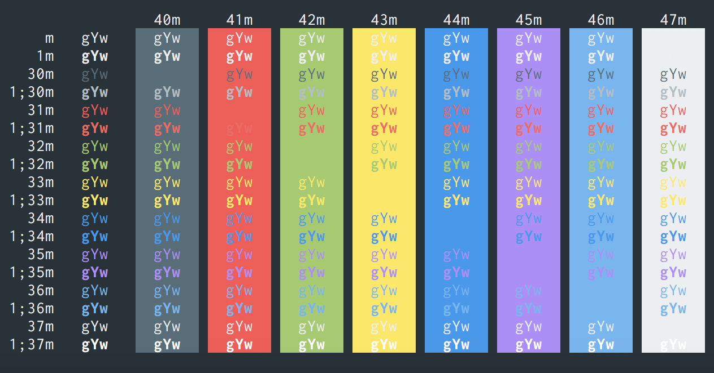

# iTerm2 Hyper Material Theme

Converted [hyperterm-material](https://github.com/dperrera/hyperterm-material) to iTerm2 Color Scheme

## How to use it

1. Clone the repo or [download the file `hyperterm-material.itermcolors`](https://raw.githubusercontent.com/naari3/iterm2-hyperterm-material/master/hyperterm-material.itermcolors)
2. *iTerm2 > Preferences > Profiles > Colors Tab*
3. Click *Color Presets...*
4. Click *Import...*
5. Select the `material-design-colors.itermcolors` file
5. Select the *material-design-colors* from *Load Presets...*

